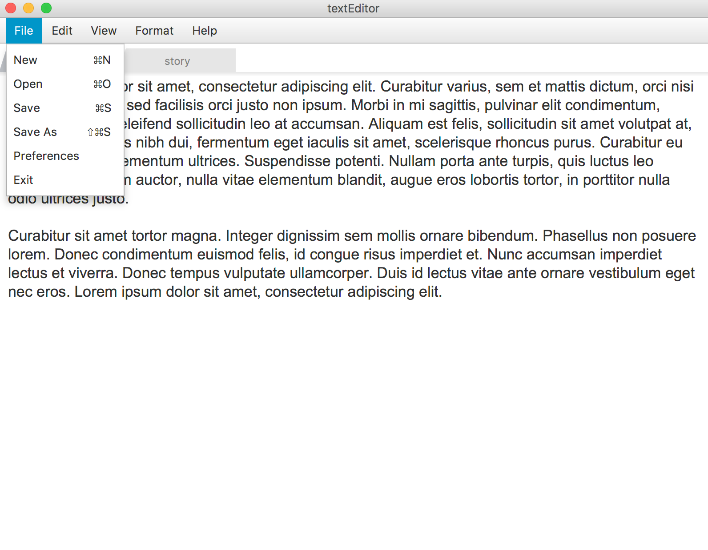
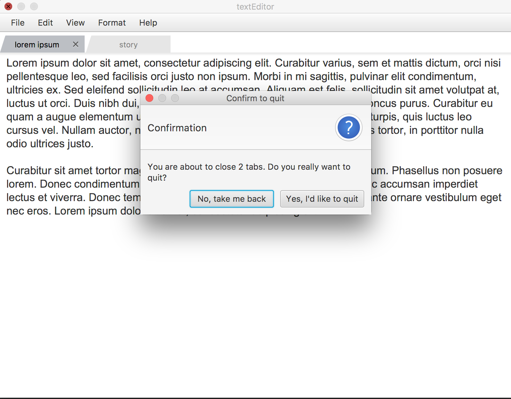
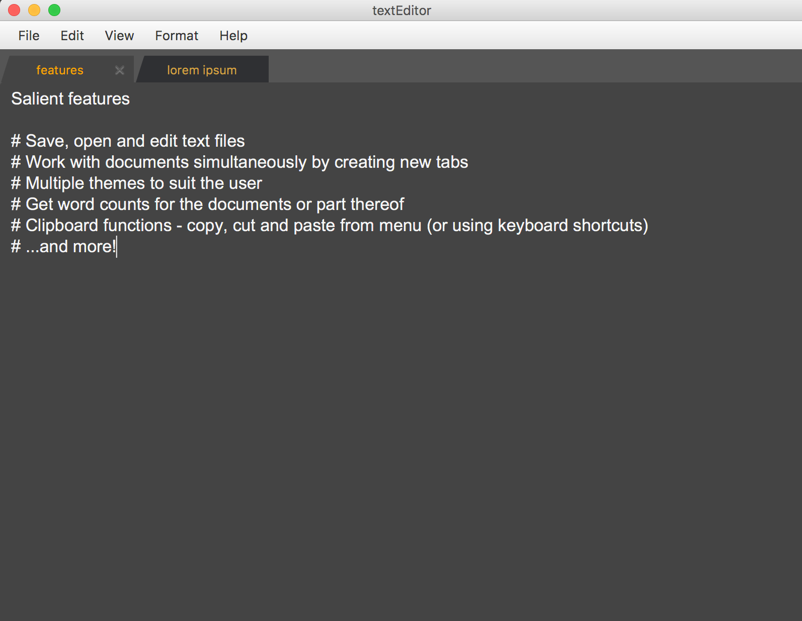

# textEditor

`textEditor` is a cross platform notepad like text editor. It is made using `Java` and `JavaFX` for the graphics.

### Screenshots

### Running textEdit
After downloading or cloning the repo, simply open `textEditor/textEditor.jar` and start editing!

##### TODO
* Add more themes